# 1. 포인트 관리

---
## 1.1. 포인트 조회
### 시퀀스 다이어그램
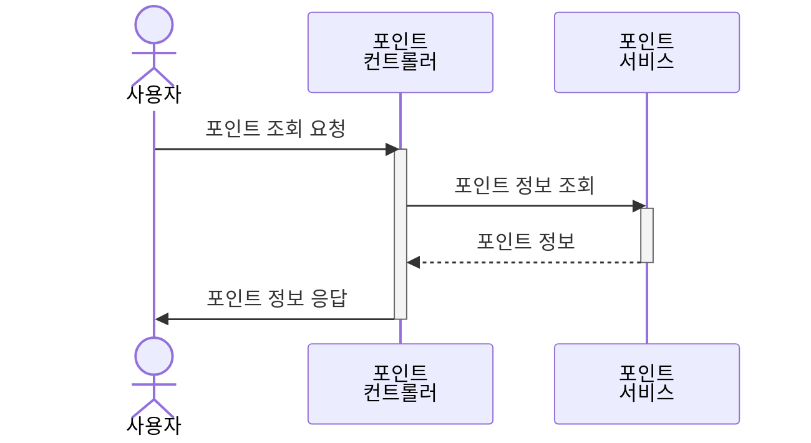

## 1.2. 포인트 충전
### 시퀀스 다이어그램
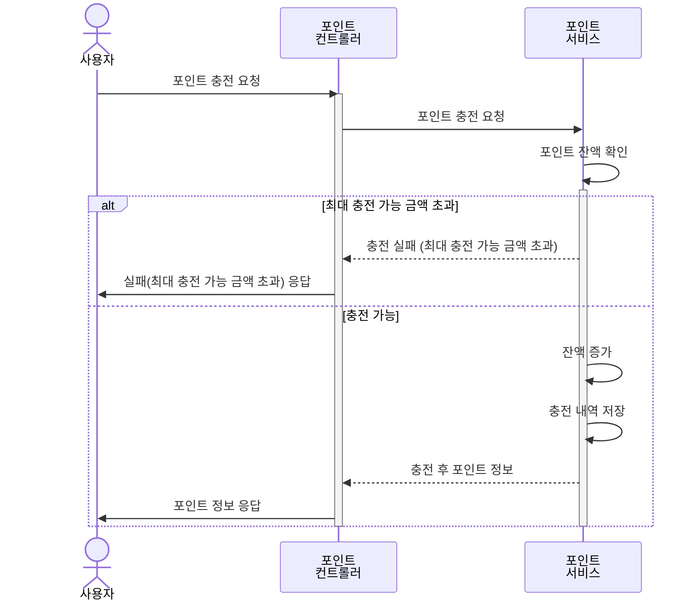

# 2. 상품 주문/결제

---
## 2.1. 상품 주문
### 플로우 차트
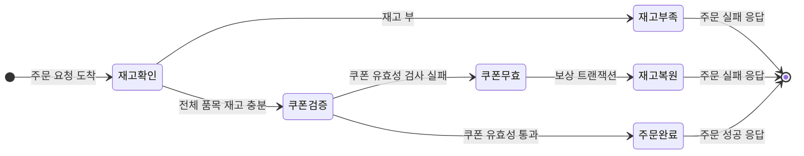
### 시퀀스 다이어그램
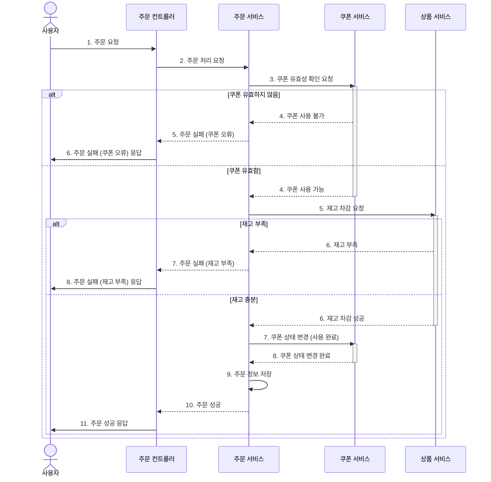

## 2.2. 상품 주문 결제
### 플로우 차트
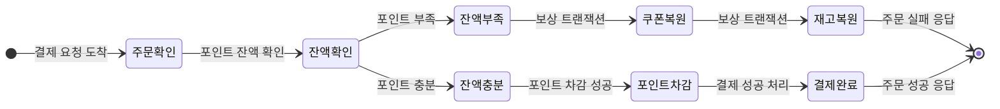
### 시퀀스 다이어그램
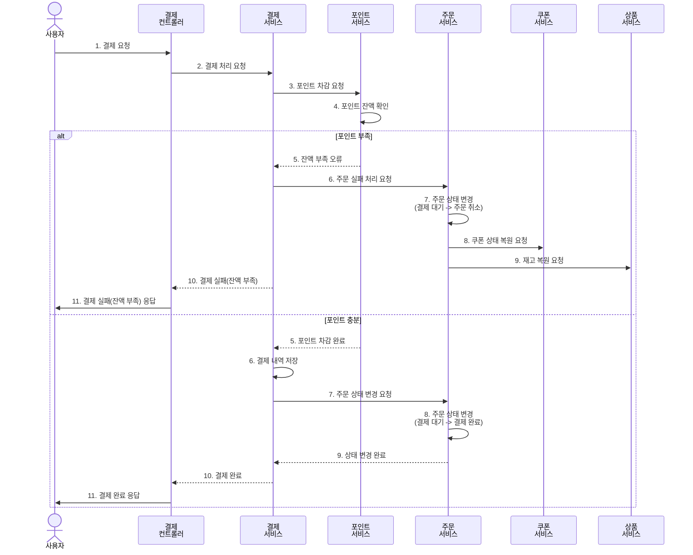
### 주문 상태 다이어그램
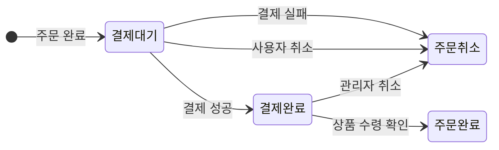

## 2.3. 주문 데이터 전송
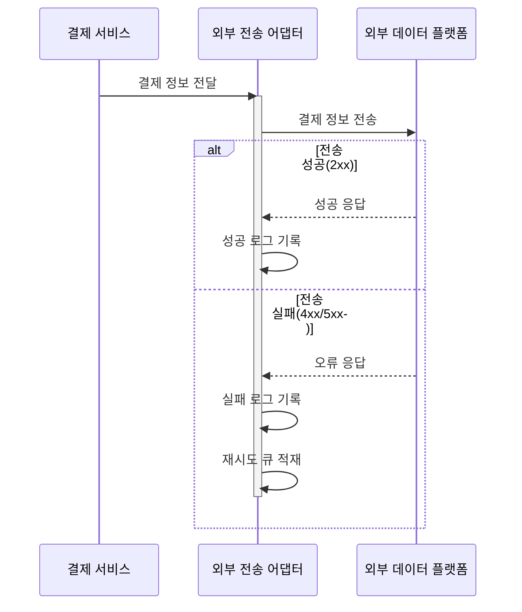

# 3. 쿠폰 관리

---
## 3.1. 쿠폰 정책 발행
### 상태 다이어그램
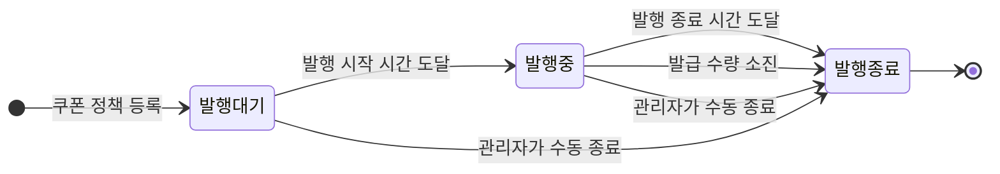
## 3.2. 사용자 쿠폰 발급
### 시퀀스 다이어그램
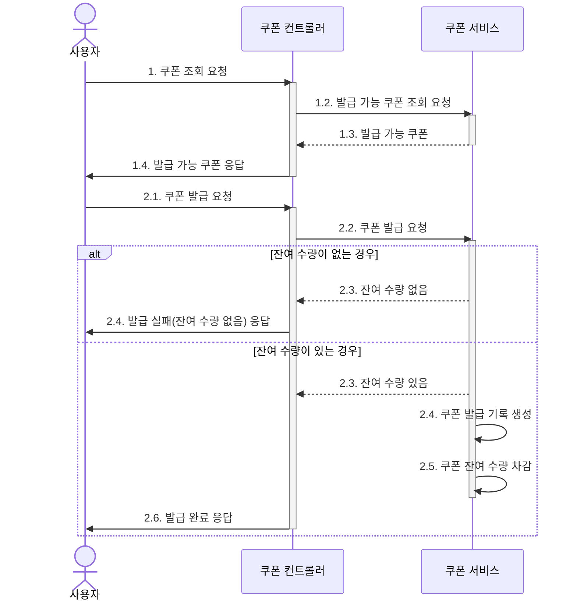
### 사용자 쿠폰 상태 다이어그램
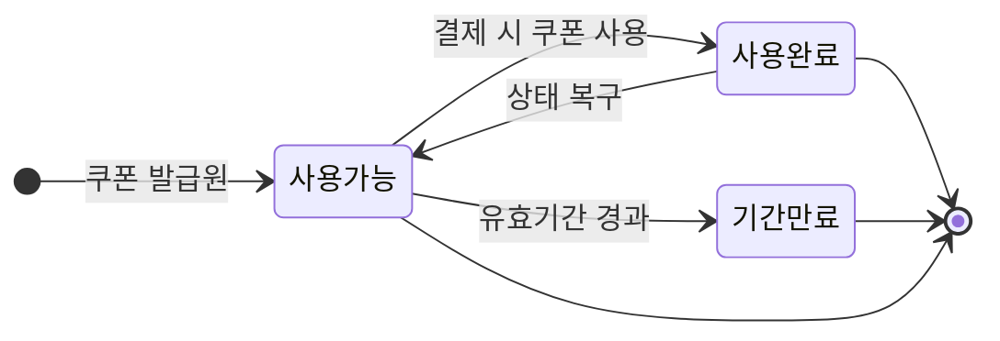
# 4. 상품 조회

---
## 4.1. 판매 우수 상품 목록 조회
### 시퀀스 다이어그램
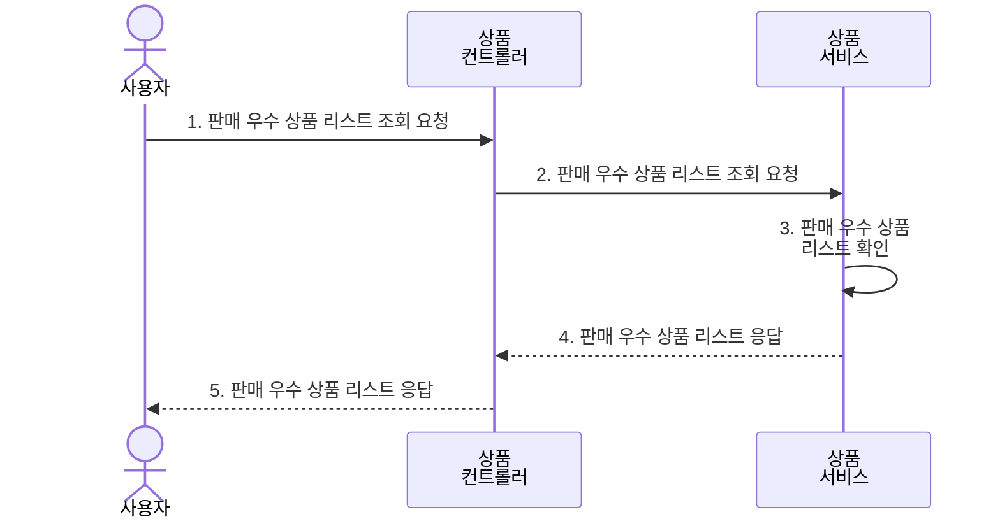