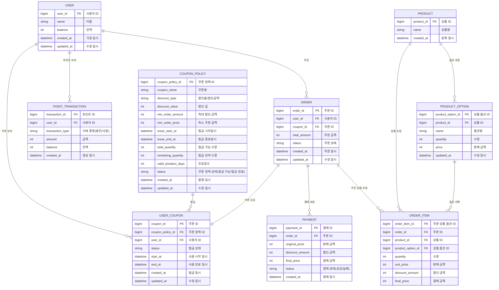

## ERD

---

```mermaid
erDiagram
   COUPON_POLICY {
      bigint coupon_policy_id PK "쿠폰 정책 ID"
      string coupon_name "쿠폰명"
      string discount_type "할인율/할인금액"
      int discount_value "할인 값"
      int min_order_amount "최대 할인 금액"
      int min_order_price "최소 주문 금액"
      datetime issue_start_at "발급 시작일시"
      datetime issue_end_at "발급 종료일시"
      int total_quantity "발급 가능 수량"
      int remaining_quantity "발급 잔여 수량"
      int valid_duration_days "유효일수"
      string status "쿠폰 정책 상태(발급 가능/발급 완료)"
      datetime created_at "발행 일시"
      datetime updated_at "수정 일시"
   }

    USER_COUPON {
        bigint coupon_id PK "쿠폰 ID"
        bigint coupon_policy_id FK "쿠폰 정책 ID"
        bigint user_id FK "사용자 ID"
        string status "발급 상태"
        datetime start_at "사용 시작 일시"
        datetime end_at "사용 만료 일시"
        datetime created_at "발급 일시"
        datetime updated_at "수정 일시"
    }

    USER {
        bigint user_id PK "사용자 ID"
        string name "이름"
        int balance "잔액"
        datetime created_at "가입 일시"
        datetime updated_at "수정 일시"
    }

    POINT_TRANSACTION {
        bigint transaction_id PK "포인트 ID"
        bigint user_id FK "사용자 ID"
        string transaction_type "거래 종류(충전/사용)"
        int amount "금액"
        int balance "잔액"
        datetime created_at "생성 일시"
    }

    PRODUCT {
        bigint product_id PK "상품 ID"
        string name "상품명"
        datetime created_at "등록 일시"
    }

    PRODUCT_OPTION {
        bigint product_option_id PK "상품 옵션 ID"
        bigint product_id FK "상품 ID"
        string name "옵션명"
        int quantity "수량"
        int price "판매 금액"
        datetime updated_at "수정 일시"
    }

    ORDER {
        bigint order_id PK "주문 ID"
        bigint user_id FK "사용자 ID"
        bigint coupon_id FK "쿠폰 ID"
        int total_amount "주문 금액"
        string status "주문 상태"
        datetime created_at "주문 일시"
        datetime updated_at "수정 일시"
    }

    ORDER_ITEM {
        bigint order_item_id PK "주문 상품 옵션 ID"
        bigint order_id FK "주문 ID"
        bigint product_id FK "상품 ID"
        bigint product_option_id FK "상품 옵션 ID"
        int quantity "수량"
        int unit_price "판매 금액"
        int discount_amount "할인 금액"
        int final_price "결제 금액"
    }

    PAYMENT {
        bigint payment_id PK "결제 ID"
        bigint order_id FK "주문 ID"
        int original_price "판매 금액"
        int discount_amount "할인 금액"
        int final_price "결제 금액"
        string status "결제 상태(성공/실패)"
        datetime created_at "결제 일시"
    }

    USER ||--o{ POINT_TRANSACTION : "포인트 보유"
    USER ||--o{ ORDER : "주문"
    USER ||--o{ USER_COUPON : "쿠폰 보유"
    PRODUCT ||--o{ PRODUCT_OPTION : "옵션 포함"
    ORDER ||--o{ ORDER_ITEM : "주문 상품 포함"
    PRODUCT ||--o{ ORDER_ITEM : "상품 포함"
    PRODUCT_OPTION ||--o{ ORDER_ITEM : "옵션 선택"
    COUPON_POLICY ||--o{ USER_COUPON : "발급"
    ORDER ||--|| USER_COUPON : "쿠폰 포힘"
    ORDER ||--o{ PAYMENT : "결제 포함"
```